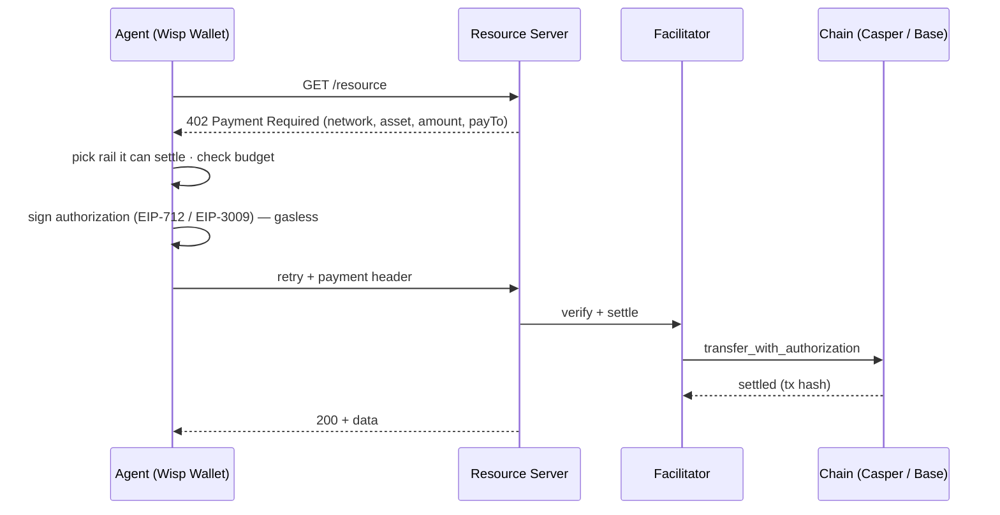
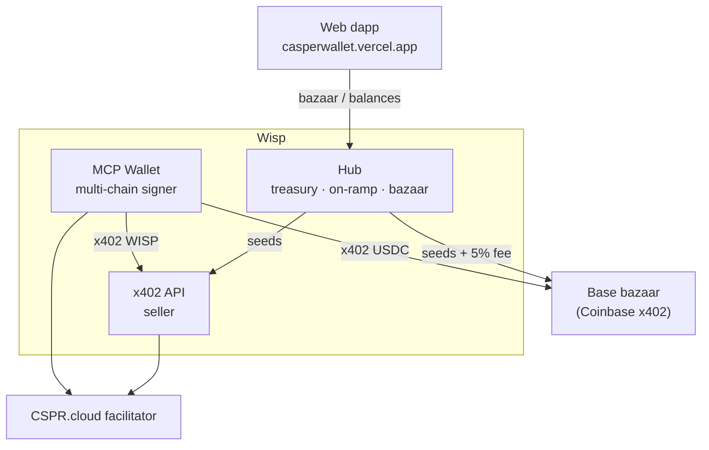

<div align="center">

# ◍ Wisp

### An agentic wallet that lets AI agents discover and pay for APIs — across chains.

Wisp gives an AI agent a real wallet and the ability to autonomously settle
[**x402**](https://x402.org) micropayments for paid HTTP APIs — **WISP on Casper** (EIP‑712,
gasless) and **USDC on Base** — picking the right rail automatically.

`Casper testnet` · `Base Sepolia` · `x402` · `CEP‑18` · `EIP‑3009` · `MCP` · `CSPR.click`

</div>

---

## Live

| Service | URL |
|---|---|
| 🪙 Web dapp | **https://casperwallet.vercel.app** |
| 🛰️ x402 API (seller) | **https://casper-api.vercel.app** |
| 🏦 Hub (treasury + bazaar) | **https://casper-backend-one.vercel.app** |

## How a payment works



## The stack



| Component | Path | What it is |
|---|---|---|
| **Wallet** | [`wallet/`](wallet/) | MCP buyer wallet (`.mcpb`) — multi-chain x402 signer, budget guardrails |
| **API** | [`seller/`](seller/) | x402 resource server, settled in WISP on Casper |
| **Hub** | [`backend/`](backend/) | treasury ledger, on-ramp credit, custodial pay, cross-chain bazaar |
| **Web** | [`web/`](web/) | CSPR.click dapp — connect, buy CSPR, browse + pay the bazaar |

> **Install in Claude Desktop:** download **wisp-wallet.mcpb** from the [latest release](https://github.com/ogsamrat/casper-agentic-wallet/releases/latest), then double-click it (or Settings → Extensions → install from file).

## Two rails, one wallet

- **Casper** → **WISP**, a CEP‑18 token with EIP‑712 `transfer_with_authorization`
  (deployed by [`wallet/scripts/deploy-token.ts`](wallet/scripts/deploy-token.ts); supply minted
  to the agent). It's a **test settlement token** — there's no Circle USDC on Casper, so Wisp
  mints its own facilitator‑compatible token to prove the loop.
- **Base** → **real USDC** (Base Sepolia), via the `@x402/evm` exact scheme. The wallet picks the
  rail from the 402's `network`, so it pays Casper *or* Base transparently.
- **Bazaar** merges Wisp's own catalog with the **Coinbase x402 Bazaar** (Base services); Base
  listings carry a **5% marketplace fee**.

## Quick start

```bash
cp .env.example .env          # WISP_MNEMONIC, CSPR_CLOUD_API_KEY, BASE_PRIVATE_KEY
cd wallet && npm install
SELLER_URL=https://casper-api.vercel.app/fx/rates npm run paytest   # pay on Casper (WISP)
BASE_URL=https://sandbox.node4all.com/v1/x402-test npx tsx src/_basepaytest.ts  # pay on Base (USDC)
```

See [ARCHITECTURE.md](ARCHITECTURE.md) for the full design. MIT licensed.
